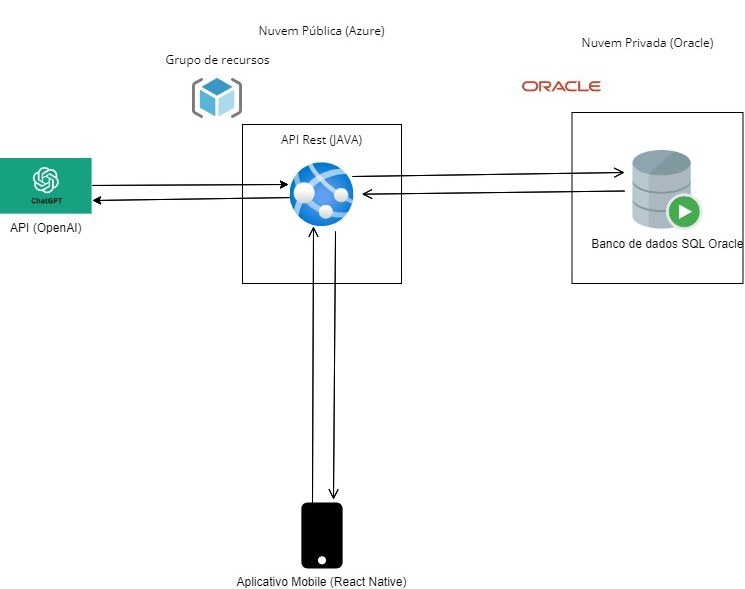

# Tourmate
* [Integrantes Japetech](#Integrantes)
* [Nossa Solução](#Solução)
* [Arquitetura](#Arquitetura)
* [Benefícios](#Benefícios)
* [Pricipais funcionalidades](#Funcionalidades)
* <details><summary><a href="#Nuvem">Como rodar o projeto (Nuvem)</a></summary>

    * [Clonanado respositório](#Clonanado)
    * [Fazendo o login na Azure](#Azure)
    * [Fazendo o Deploy](#BuildDeploy)
    * [Acessando o projeto](#Acessando)
    * [Testes](#Testes)
  </details>

* [AVISO IMPORTANTE](#Aviso)

* <details><summary><a href="#Videos">Videos</a></summary>
  * [DevOps](#DevOps)
  * [Digital Business Enablement](#DBE)
</details>
## Integrantes:
| Nome                        | RM      | Turma      |
|-----------------------------|---------|------------|
| Diogo Giarranti Kahn        | RM92928 | 2TDSPG     |
| Heitor Borba Marini         | 92976   | 2TDSS      |
| Luís Felipe Garcia Menezes  | 94051   | 2TDST      |
| Mateus da Costa Leme        | 93480   | 2TDSPG     |
| Pedro Henrique Chueiri      | 93939   | 2TDSPG     |

## Solução:
O TourMate é um aplicativo para gerenciamento de viagens, que utiliza o Chat GPT para auxiliar o usuário na seleção da viagem ideal, gerando sugestões de viagem personalizadas com base no perfil. Além disso, o aplicativo dará sugestões de rotas para descobrir passeios turísticos, meios de transporte, restaurantes e a proveitar ao máximo que o que o destino tem a oferecer.

## Arquitetura:


Nosso projeto, um aplicativo mobile, se conectará com nossa API, que fará todos os principais CRUDs e a conexão com o a API da OpenAI, possibilitando acesso ao modelo GPT-3.5. As informações serão armazenadas em um banco de dados Oracle SQL, que por sua vex está alocado em uma Nuvem Privada.

## Benefícios:
A Tourmate busca trazer uma maior personalização e facilidade na hora de identificar e planejar a melhor viagem. A tecnologia do GPT possibilita uma experiência personalizável, permitindo uma maior compatibilidade e precisão nas recomendações.<br><br>
Com a enorme base de dados do GPT, é possível trazer à tona uma grande diversidade de opções, dando maior visibilidade para diversos possíveis locais de viagem, trazendo público e movimentando economias locais que, de outra forma, estariam estagnadas, principalmente na baixa temporada.<br><br>
Empresas focadas em viagens, como hotéis, restaurantes e sites, também podem se benefíciar de nossa solução, uma vez que possibilitamos uma integração dessas empresas em nossa aplicação, ajudando o usuário a encontrar as melhores opções, e empresas a encontrar mais clientes e usuários.

## Funcionalidades:
* Nossa aplicação permitirá o cadastro de novos usuários e a autenticação de usuários já cadastrados.<br><br>
* O usuário poderá editar suas informações, visualizar seus dados e apagar sua conta, caso queira.<br><br>
* O sistema exibirá para o usuário opções de viagens com planos personalizados de acordo com suas preferências. Esses planos de viagem irão conter um breve resumo da cidade que poderão visitar, o valor estimado da viagem e o que fazer no local durante o período especificado.<br><br>
* Nossa aplicação também permitirá que parceiros possam se cadastrar e divulgar seus serviços, como hotéis, restaurantes, etc.<br><br>
* O usuário poderá visualizar os serviços disponíveis e escolher os que mais lhe agradam.

## Nuvem:
Para rodar o projeto é necessário ter uma conta na Azure Portal, pois utilizaremos o serviço de WebApp para fazer o Deploy do projeto.<br><br>
Todo o processo será feito via terminal CMD, porém é possível fazer o mesmo processo via Azure Portal.<br><br>
### **Importante ressaltar que para fazer o deploy via CMD é necessário ter o [Azure CLI](https://aka.ms/installazurecliwindows) e o [Apache Maven](https://maven.apache.org/download.cgi) instalados em sua máquina.**<br>

#### Clonanando:
```bash
git clone https://github.com/LuisFelipeGM/TourMate-Japetech.git
```
#### Azure:
```bash
az login
```
#### BuildDeploy:
```bash
mvn clean install
```
```bash
mvn azure-webapp:deploy
```
#### Acessando:
Após o deploy, acesse o link gerado pelo Azure WebApp para acessar o projeto (o link estará disponível nas informações do Deploy no CMD).
#### Testes:
Os testes podem ser feitos via postman, importando o arquivo [TourMate Collection .json](./collections/tm_collection.json) para o postman.
## Aviso:
Altere as credenciais do Banco de Dados no arquivo [application.properties](./src/main/resources/application.properties)

# Videos:
## DevOps:
<a href="https://www.youtube.com/watch?v=6ieReb4PFlk">
  
</a>

## DBE:
<a href="https://www.youtube.com/watch?v=-P8LOsY4tVs">
  
</a>